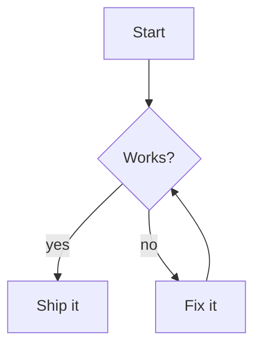
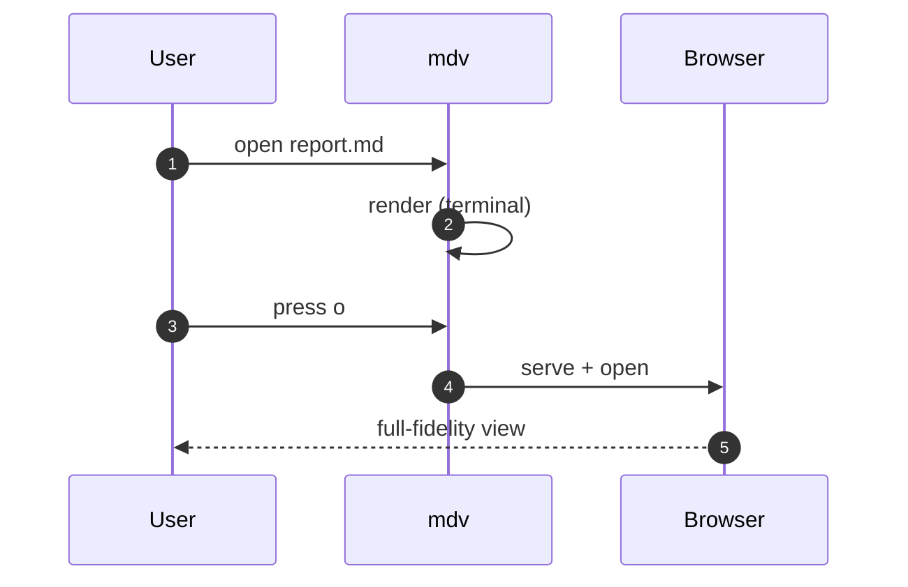
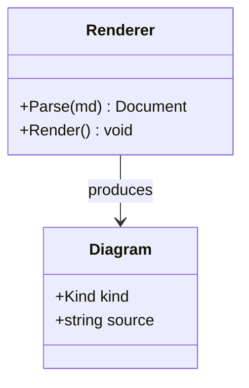
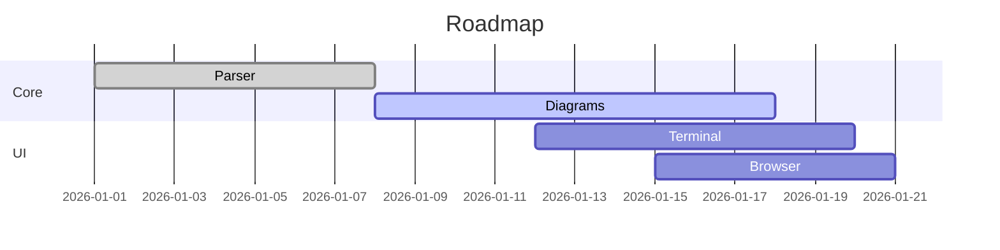

# mdv Demo

[[_TOC_]]

Welcome to **mdv**, a terminal-first Markdown viewer with an optional browser mode.[^intro]

[^intro]: This sentence has a footnote; its definition appears in the Footnotes section at the bottom.

## Features

- Live reload on file change (scroll position preserved)
- `[[_TOC_]]` table of contents (Azure DevOps style)
- Search and navigation
- Mermaid and D2 diagrams
- Math via KaTeX
- Multi-file wiki navigation

> [!NOTE]
> This document exercises every major feature. Edit it while `mdv` is running to see live reload.

## Text formatting

This paragraph mixes **bold**, *italic*, ***bold italic***, `inline code`, ~~strikethrough~~, and a
[regular link](https://opencode.ai). Emoji shortcodes work too: :rocket: :sparkles: :tada:.

Extended emphasis: water is H~2~O (subscript), Einstein wrote E = mc^2^ (superscript),
this is ++inserted++ text, and this is ==highlighted== text. Abbreviations like HTML and CSS
keep their term and are underlined.

*[HTML]: HyperText Markup Language
*[CSS]: Cascading Style Sheets

Two trailing spaces force a hard line break —
this text starts on a brand-new line.

Ordered lists can start at any number:

5. Fifth step
6. Sixth step
7. Seventh step

## GitHub alerts

All five alert kinds are recognized and styled with their own icon, title, and color:

> [!NOTE]
> Useful information that users should know, even when skimming.

> [!TIP]
> Helpful advice for doing things better or more easily.

> [!IMPORTANT]
> Key information users need to know to achieve their goal.

> [!WARNING]
> Urgent info that needs immediate user attention to avoid problems.

> [!CAUTION]
> Advises about risks or negative outcomes of certain actions.

### Code with highlighting

Inline code like `dotnet build`, `Get-ChildItem`, and `npm run dev` renders distinctly. Below are
full snippets across several languages so you can see the syntax highlighting and the `bat`-style
gutter with line numbers.

#### C#

```csharp
using System;
using System.Linq;
using System.Threading.Tasks;

namespace Mdv.Sample;

public sealed record Person(string Name, int Age)
{
    public bool IsAdult => Age >= 18;
}

public static class Program
{
    public static async Task Main()
    {
        var people = new[]
        {
            new Person("Ada", 36),
            new Person("Linus", 17),
            new Person("Grace", 85),
        };

        var adults = people
            .Where(p => p.IsAdult)
            .OrderByDescending(p => p.Age)
            .Select(p => $"{p.Name} ({p.Age})");

        foreach (var line in adults)
            Console.WriteLine(line);

        await Task.Delay(TimeSpan.FromMilliseconds(50));
    }
}
```

#### PowerShell

```powershell
#Requires -Version 7.0
[CmdletBinding()]
param(
    [Parameter(Mandatory)][string]$Path,
    [int]$MinSizeKB = 100
)

# Find large files and group them by extension
Get-ChildItem -Path $Path -Recurse -File -ErrorAction SilentlyContinue |
    Where-Object { $_.Length -gt ($MinSizeKB * 1KB) } |
    Group-Object Extension |
    Sort-Object { ($_.Group | Measure-Object Length -Sum).Sum } -Descending |
    ForEach-Object {
        $totalMB = [math]::Round((($_.Group | Measure-Object Length -Sum).Sum) / 1MB, 2)
        [pscustomobject]@{
            Extension = if ($_.Name) { $_.Name } else { '(none)' }
            Count     = $_.Count
            TotalMB   = $totalMB
        }
    } | Format-Table -AutoSize
```

#### JavaScript

```javascript
// Debounce an async function and cache the latest result
function debounceAsync(fn, delayMs = 200) {
  let timer;
  let pending;
  return (...args) => {
    clearTimeout(timer);
    return new Promise((resolve, reject) => {
      timer = setTimeout(async () => {
        try {
          pending = await fn(...args);
          resolve(pending);
        } catch (err) {
          reject(err);
        }
      }, delayMs);
    });
  };
}

const search = debounceAsync(async (query) => {
  const res = await fetch(`/api/search?q=${encodeURIComponent(query)}`);
  if (!res.ok) throw new Error(`HTTP ${res.status}`);
  return res.json();
});

search("markdown").then((hits) => console.log(`${hits.length} results`));
```

#### TypeScript

```typescript
type Result<T, E = Error> =
  | { ok: true; value: T }
  | { ok: false; error: E };

async function tryFetch<T>(url: string): Promise<Result<T>> {
  try {
    const res = await fetch(url);
    if (!res.ok) return { ok: false, error: new Error(`HTTP ${res.status}`) };
    return { ok: true, value: (await res.json()) as T };
  } catch (error) {
    return { ok: false, error: error as Error };
  }
}

interface User { id: number; name: string; roles: readonly string[] }

const result = await tryFetch<User>("/api/user/1");
if (result.ok) {
  console.log(result.value.name.toUpperCase());
} else {
  console.error(result.error.message);
}
```

#### Python

```python
from dataclasses import dataclass
from functools import lru_cache


@dataclass(frozen=True)
class Point:
    x: float
    y: float

    def distance_to(self, other: "Point") -> float:
        return ((self.x - other.x) ** 2 + (self.y - other.y) ** 2) ** 0.5


@lru_cache(maxsize=None)
def fib(n: int) -> int:
    return n if n < 2 else fib(n - 1) + fib(n - 2)


if __name__ == "__main__":
    origin = Point(0, 0)
    print(f"distance: {origin.distance_to(Point(3, 4)):.1f}")
    print([fib(i) for i in range(10)])
```

#### Rust

```rust
use std::collections::HashMap;

fn word_count(text: &str) -> HashMap<&str, usize> {
    let mut counts = HashMap::new();
    for word in text.split_whitespace() {
        *counts.entry(word).or_insert(0) += 1;
    }
    counts
}

fn main() {
    let text = "the quick brown fox the lazy dog the end";
    let mut pairs: Vec<_> = word_count(text).into_iter().collect();
    pairs.sort_by(|a, b| b.1.cmp(&a.1));
    for (word, count) in pairs.iter().take(3) {
        println!("{word}: {count}");
    }
}
```

#### Go

```go
package main

import (
	"fmt"
	"sort"
)

func main() {
	scores := map[string]int{"ada": 92, "linus": 88, "grace": 99}

	names := make([]string, 0, len(scores))
	for name := range scores {
		names = append(names, name)
	}
	sort.Slice(names, func(i, j int) bool {
		return scores[names[i]] > scores[names[j]]
	})

	for _, name := range names {
		fmt.Printf("%-6s %d\n", name, scores[name])
	}
}
```

#### SQL

```sql
WITH ranked AS (
    SELECT
        customer_id,
        order_total,
        ROW_NUMBER() OVER (
            PARTITION BY customer_id
            ORDER BY order_total DESC
        ) AS rn
    FROM orders
    WHERE order_date >= '2026-01-01'
)
SELECT customer_id, order_total
FROM ranked
WHERE rn = 1
ORDER BY order_total DESC
LIMIT 10;
```

#### Bash

```bash
#!/usr/bin/env bash
set -euo pipefail

# Back up files modified in the last day into a timestamped archive
backup_dir="${1:-$HOME/backups}"
stamp="$(date +%Y%m%d-%H%M%S)"
archive="${backup_dir}/recent-${stamp}.tar.gz"

mkdir -p "$backup_dir"
find . -type f -mtime -1 -print0 \
  | tar --null -czf "$archive" --files-from=-

echo "Wrote $(du -h "$archive" | cut -f1) to $archive"
```

#### JSON

```json
{
  "name": "mdv",
  "version": "0.1.0",
  "features": ["mermaid", "d2", "math", "live-reload"],
  "engines": { "dotnet": ">=10.0" },
  "keybindings": {
    "scroll": ["j", "k"],
    "search": "/",
    "quit": "q"
  }
}
```

#### YAML

```yaml
name: ci
on:
  push:
    branches: [main]
jobs:
  build:
    runs-on: ubuntu-latest
    steps:
      - uses: actions/checkout@v4
      - name: Setup .NET
        uses: actions/setup-dotnet@v4
        with:
          dotnet-version: "10.0.x"
      - run: dotnet build --configuration Release
```

#### Diff

```diff
 public static int Add(int a, int b)
 {
-    return a + b;
+    checked { return a + b; }
 }
```

### Tables

Column alignment (`:--`, `:-:`, `--:`) is honored, and **wide cells wrap** instead of being truncated.

| Feature   | Terminal | Browser |
| --------- | :------: | ------: |
| Mermaid   |    ✓     |       ✓ |
| D2        |    ✓     |       ✓ |
| Live edit |    ✓     |       ✓ |

| Option        | What it does                                                                                          |
| ------------- | ----------------------------------------------------------------------------------------------------- |
| `--browser`   | Opens the document in your browser for full-fidelity rendering of mermaid, D2, and math via KaTeX.    |
| `--best-effort` | Skips the one-time headless-browser download in the terminal; mermaid diagrams open in the browser on demand instead of rendering inline as Sixel. |
| `--theme`     | Chooses dark, light, or auto. Auto honors `COLORFGBG` when present and otherwise defaults to dark.    |

### Long links wrap

Long, unbreakable URLs wrap to the next line instead of being clipped at the screen edge:
https://example.com/some/really/long/path/that/keeps/going/and/going/until/it/exceeds/the/terminal/width/and/needs/to/wrap.html

### Task list

- [x] Parse markdown
- [x] Render diagrams
- [x] Tables, alerts, footnotes, definition lists
- [ ] Conquer the world

### Nested & loose lists

Unordered bullets change with nesting depth, and loose lists get spacing:

- Top level
  - Second level
    - Third level
- Back to top

1. First (loose)

2. Second, with a blank line between items

3. Third

## Diagrams

### Mermaid



### D2

```d2
client -> server: request
server -> db: query
db -> server: rows
server -> client: response
```

## Math

The quadratic formula is $x = \frac{-b \pm \sqrt{b^2 - 4ac}}{2a}$.

$$
\int_0^\infty e^{-x^2}\,dx = \frac{\sqrt{\pi}}{2}
$$

Environments (matrices, cases, aligned) lay out across rows and columns:

$$
\begin{pmatrix} a & b \\ c & d \end{pmatrix}
$$

$$
\begin{cases} x + y = 1 \\ 2x - y = 0 \end{cases}
$$

## Images & media

Images can be local or remote. In the terminal they render inline (Sixel) where supported;
in the browser they display normally.

### Local PNG


### Local SVG


### Remote image


### Image as a link

[](https://opencode.ai)

### Badges (inline images)

  

### Sequence diagram (mermaid)



### Class diagram (mermaid)



### Gantt (mermaid)



### D2 (grid)

```d2
direction: right
ui: UI {
  terminal
  browser
}
core: Core {
  parser
  diagrams
}
ui.terminal -> core.parser
ui.browser -> core.parser
core.parser -> core.diagrams
```

## Navigation

See the [second page](./page2.md) for multi-file navigation.

## Glossary (definition list)

Sixel
:   A terminal graphics protocol used to draw diagrams and images inline.

Front matter
:   A leading YAML metadata block (delimited by `---`) that is recognized and stripped from the rendered output.

## Footnotes

Footnotes let you add references[^demo] and asides[^aside] without breaking the flow of reading.
They render as superscript markers in the text and a numbered list at the bottom of the document.

[^demo]: A numbered footnote definition. Markers in the text link to these entries.
[^aside]: Footnotes can be referenced by any label (here, "aside") and are renumbered in order.

^^ Generated by mdv — a terminal-first Markdown viewer. ^^

